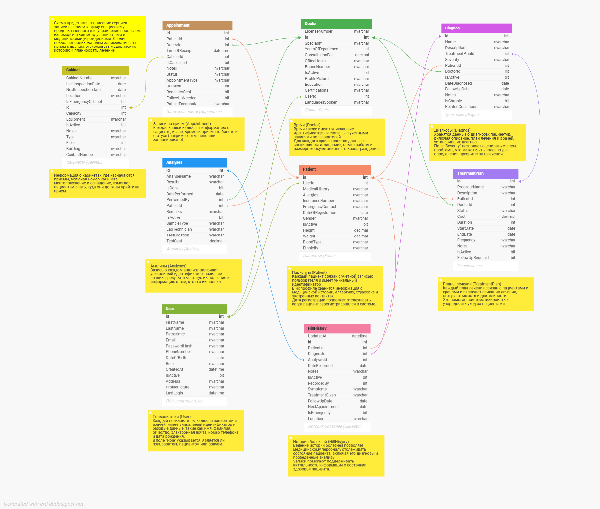

# Архитектура ПО
## Урок 6. Принципы построения приложений «чистая архитектура»

На семинаре с преподавателем проектируется UML диаграмма классов приложения для медицинского центра. 

## ЗАДАНИЕ

Разработать полную ERD домена в https://www.dbdesigner.net/.

Сервис записи на прием к врачу-специалисту предназначен для управления процессом взаимодействия между пациентами и медицинскими учреждениями. Он позволяет пользователям записываться на прием к врачам, отслеживать медицинскую историю и планировать лечение. 

## РЕШЕНИЕ

1. ERD домена
   

2. Скрипт SQL:

[SQL_Cервис записи к врачу](02.sql)

3. Основные компоненты сервиса

1. Пользователи (User):
   - Каждый пользователь, включая пациентов и врачей, имеет уникальный идентификатор и базовые данные, такие как имя, фамилия, отчество, электронная почта, номер телефона и дата рождения. 
   - В поле "Role" указывается, является ли пользователь пациентом или врачом.

2. Пациенты (Patient):
   - Каждый пациент связан с учетной записью пользователя и имеет уникальный идентификатор.
   - В их профиле хранится информация о медицинской истории, аллергиях, страховке и экстренных контактах.
   - Дата регистрации позволяет отслеживать, когда пациент зарегистрировался в системе.

3. Врачи (Doctor):
   - Врачи также имеют уникальные идентификаторы и связаны с учетными записями пользователей.
   - Для каждого врача хранятся данные о специальности, лицензии, опыте работы и размере консультационного вознаграждения.
   - Информация об их рабочем времени позволяет пациентам планировать приемы.

4. Анализы (Analyses):
   - Запись о каждом анализе включает уникальный идентификатор, название анализа, результаты, статус выполнения и информацию о том, кто его выполнил.
   - Это позволяет отслеживать медицинские процедуры, проведенные для пациента.

5. Диагнозы (Diagnos):
   - Хранятся данные о диагнозах пациентов, включая описание, план лечения и врачей, установивших диагноз.
   - Поле "Severity" позволяет оценивать степень проблемы, что может быть полезно для определения приоритетов в лечении.

6. Планы лечения (TreatmentPlan):
   - Каждый план лечения связан с пациентами и врачами и включает описание лечения, статус, стоимость и длительность.
   - Это помогает систематизировать и упорядочить уход за пациентами.

7. История болезней (HillHistory):
   - Ведение истории болезней позволяет медицинскому персоналу отслеживать состояние пациента, включая его диагнозы и проведенные анализы.
   - Данные о нотах и записях помогают поддерживать актуальность информации о состоянии здоровья пациента.

8. Записи на прием (Appointment):
   - Каждая запись включает информацию о пациенте, враче, времени приема, кабинете и статусе (например, отменено или запланировано).
   - Этот компонент жизненно важен для координации приемов и управления расписанием врачей.

9. Кабинеты (Cabinet):
   - Информация о кабинетах, где назначаются приемы, включая номер кабинета, местоположение и оснащение, помогает пациентам знать, где они должны явиться.

### Функции сервиса:

— Запись на прием: Пациенты могут просматривать расписания врачей, выбирать удобное время и записываться на прием.
— Управление медицинскими данными: Врачи могут добавлять и обновлять медицинские записи, анализы и диагнозы, а также отслеживать лечение и прогресс своих пациентов.
— Уведомления и напоминания: Данная функция позволяет пользователям быть в курсе предстоящих приемов и важных событий, связанных с их здоровьем.
— История взаимодействий: Все взаимодействия (приемы, анализы, диагнозы) автоматически сохраняются в базе данных, обеспечивая мгновенный доступ к истории болезни.

Таким образом, сервис записи на прием к врачу-специалисту предоставляет эффективное решение для управления медицинскими приемами, облегчая взаимодействие между пациентами и врачами, а также улучшая качество обслуживания в медицинских учреждениях.

